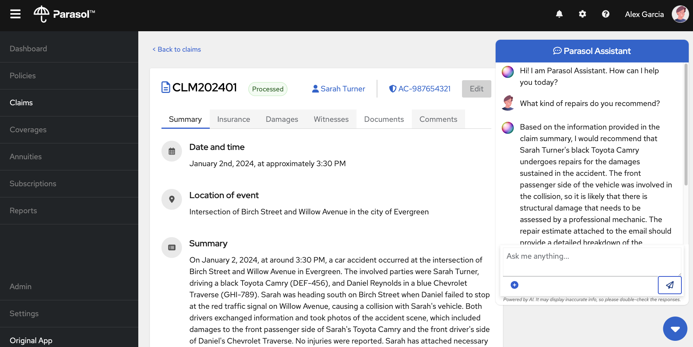

# Parasol Insurance

A [Quarkus](https://quarkus.io) + [React](https://react.dev/) AI app for managing ficticious insurance claims.



## Pre-requisites

- Java 17 or later -- Get it https://adoptium.net/  or install using your favorite package manager.
- Maven 3.9.6 or later -- Get it https://maven.apache.org/download.cgi or install using your favorite package manager.
- Node.js 21 or later -- Get it https://nodejs.org/en/download/package-manager here) or install using your favorite package manager.
- An OpenAI-capable LLM inference server. Get one here with [InstructLab](https://github.com/instructlab/instructlab)!

## To Configure on InstructLab instance of Red Hat Demo Platform


Install Node.js
```
curl -o- https://raw.githubusercontent.com/nvm-sh/nvm/master/install.sh  > install.sh
chmod +x install.sh
./install.sh
```

Install zip
```
sudo dnf install zip -y
```

Install sdkman in order to get newer versions of Java and Maven. Then install Quarkus, Java, and Maven.
```
curl -s "https://get.sdkman.io" | bash
sdk install quarkus
sdk install java 22.0.1-tem
sdk install maven
```

edit app/frontend/webpack.dev.js and insert `    allowedHosts: 'all',` after the line `     historyApiFallback: true,`

edit the confix.tsx file for the front end and change localhost to the hostname of your system

```
vi ~/code/parasol-insurance/app/frontend/src/app/config.tsx
```

After this you can follow the instructions in the **Running** section.


## Configuration

You can change the coordinates (host/port and other stuff) for the LLM and backend in `app/backend/src/main/resources/application.properties`.

## Running

First, get your inference server up and running. For example, with [InstructLab](https://github.com/instructlab/instructlab), the default after running `ilab serve` is that the server is listening on `localhost:8000`. This is the default for this app as well.

Then:

```
cd app; npm install
cd frontend; npm install
cd ../..
./start-dev.sh
```
Frontend web app will open on `0.0.0.0:8006`, backend on `0.0.0.0:8005`.

Open the app, click on a claim, click on the chat app, and start asking questions. The context of the claim is sent to the LLM along with your Query, and the response is shown in the chat (it may take time depending on your machine's performance).
